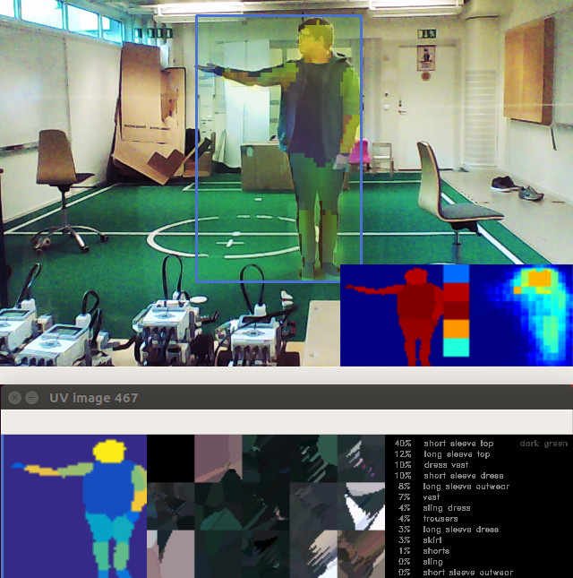

# DenseSense
WIP: Integration of Facebook's DensePose algorithm with person tracking and clothing recognition

This project includes:
* A DensePose (detectron2) wrapper, which does some post processing to merge all output layers into one.
* A sanitizer which merges and masks DensePose output to more accurately detect individual people.
* A Kalman Filter tracker to correlate detected individuals across multiple frames.
* An UV-mapper which projects each person Segmentation onto a standardized flat image.
* WIP: a descriptionExtractor which identifies the kind of clothing and what color that people are wearing.
* WIP: a pose detector which classifies what each person is doing.

Included are a web cam example which all above features utilized, 
and a training script for regenerating the models which can be trained.
There are however trained models included under ./models.



## To install:
Install [PyTorch](https://pytorch.org/)

Install all the dependencies:
```bash
python -m pip install -r ./DenseSense/requirements.txt
```
Install [detectron2](https://github.com/facebookresearch/detectron2) from cloned github repository:
```bash
git clone https://github.com/facebookresearch/detectron2/
git checkout 94d0f13
cd detectron2 && python -m pip install -e .
```

Install DenseSense by running the following in the DenseSense repo:
```bash
pip install .
```

Get the DensePose model configuration file and put in under ./models. Be sure to also get the BaseConfig:
https://github.com/facebookresearch/detectron2/tree/master/projects/DensePose/configs

Also get DensePose model and put it under ./models:
https://github.com/facebookresearch/detectron2/blob/master/projects/DensePose/doc/MODEL_ZOO.md

Currently DenseSense is configured for densepose_rcnn_R_50_FPN_s1x.yaml and R_50_FPN_s1x.pkl,
but this can be changed by modifying the paths in the beginning of `./DenseSense/algorithms/DensePoseWrapper.py`.
Adding a configuration file for DenseSense is TODO.


## Getting the datasets for training
Sanitizer: COCO (script included for downloading just the training instances with people in)

DescriptionExtractor: DeepFashion2

### [COCO](http://cocodataset.org/#download)
Download the instances val/train 2014/2017 annotation file, place it in the annotations folder, and run downloadCocoPeople.py from inside the data folder. This will download all the images and place them in data.

### [Deepfashion2](https://github.com/switchablenorms/DeepFashion2)
Download (you have to fill out a form) and place data under ./data/DeepFashion2/{val, train}. Place the annotation fileS inside ./annotations/deepfashion2_annotations_{val, train}. Afterwards run deepfashion2_to_coco.py from inside ./annotations.

## Example debug output
TODO
     
